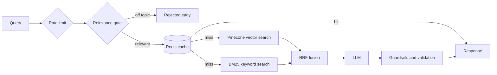
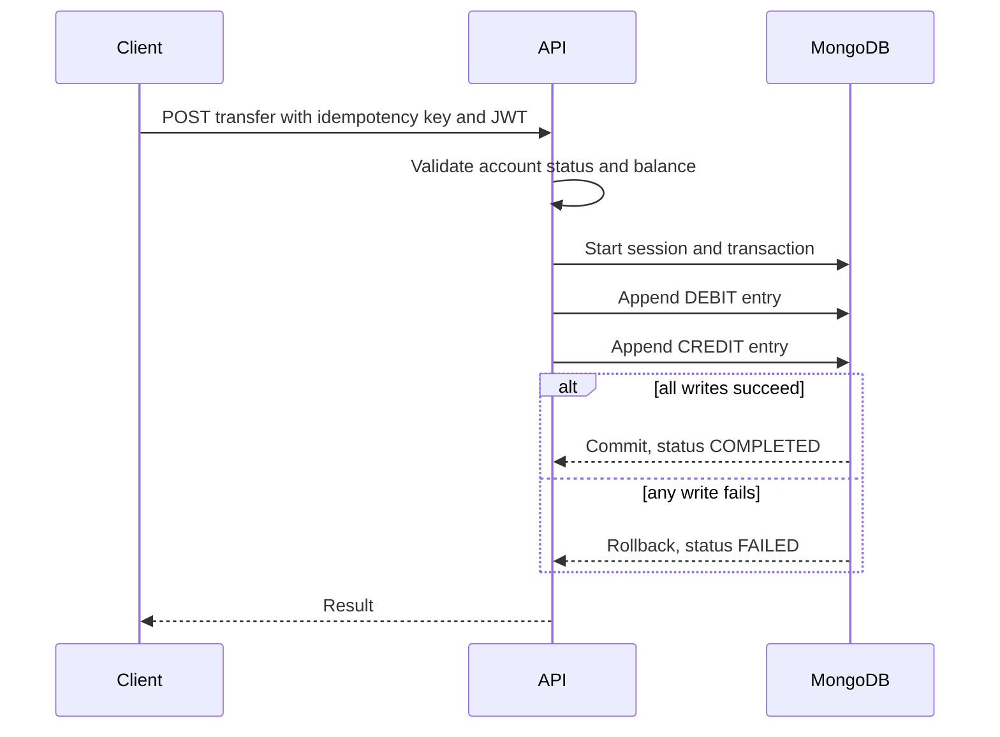

<div align="center">

</div>

<div align="center">

</div>

<br/>

<div align="center">

&nbsp;
&nbsp;


</div>

<div align="center">

[](https://www.linkedin.com/in/devdoshi19/)&nbsp;
[](mailto:devdoshi1927@gmail.com)&nbsp;
[](https://leetcode.com/u/DevDoshi_19/)&nbsp;
[](https://hackerrank.com/profile/devdoshi1927)

</div>

---

## ◈ About

```python
class DevDoshi:
    role      = "Software Engineer (backend-leaning)"
    degree    = "B.Tech — Artificial Intelligence & Data Science"
    cgpa      = 9.48
    institute = "ADIT, CVM University"
    batch     = 2027
    focus     = ["Backend Systems", "API Design", "Data Consistency"]
    stack     = ["Python", "Node.js", "FastAPI", "PostgreSQL", "MongoDB", "Redis"]
    practicing = ["DSA", "Low-Level Design", "System Design"]
    motto     = "Make it correct, then fast, then observable. Ship often."
```

Final-year engineering student with a **9.48 CGPA** who likes the unglamorous parts of software: **race conditions, idempotency, failure modes, and latency budgets**. Most of my projects start from a systems question ("how do I make a transfer atomic?", "how do I stop this endpoint from being abused?") and end with something containerized and deployable.

I also build LLM-powered systems, but I treat them as one more service to design, test, cache, rate-limit, and monitor properly.

<br/>

**Open To**

&nbsp;
&nbsp;


---

## ◈ Tech Stack

**Languages**

[](https://python.org)&nbsp;
[](https://developer.mozilla.org/docs/Web/JavaScript)&nbsp;
[](https://postgresql.org)

**Backend & APIs**

[](https://nodejs.org)&nbsp;
[](https://expressjs.com)&nbsp;
[](https://fastapi.tiangolo.com)&nbsp;
&nbsp;
&nbsp;
&nbsp;


**Databases & Caching**

[](https://postgresql.org)&nbsp;
[](https://mongodb.com)&nbsp;
[](https://redis.io)

**DevOps & Cloud**

[](https://docker.com)&nbsp;
[](https://kubernetes.io)&nbsp;
[](https://github.com/features/actions)&nbsp;
[](https://aws.amazon.com)&nbsp;
[](https://git-scm.com)

**Applied AI (secondary)**

&nbsp;
&nbsp;
&nbsp;
&nbsp;
&nbsp;
&nbsp;


---

## ◈ Featured Projects

### 🧠 [VaultMind](https://github.com/DevDoshi19/VaultMind) — Hybrid Retrieval Engine

`Python` `FastAPI` `Pinecone` `BM25` `Redis` `Docker` `Kubernetes` `GitHub Actions`

A production-style retrieval backend, built as a **systems project first, an AI project second**.

- 🔀 **Hybrid retrieval:** Pinecone vector search + BM25, merged with **Reciprocal Rank Fusion**, for a **50% gain in answer accuracy**
- 🚪 **Relevance gate** using semantic similarity scoring that skips unnecessary LLM calls and cuts **token spend by 30%**
- ⚡ **Redis caching + per-user rate limiting** (10 req/min): **40% lower latency** and protection from abuse
- 🛡️ **Multi-layer guardrails:** confidence scoring, prompt-injection defense, topic scoping, response validation
- 🐳 Decoupled frontend/backend, containerized with Docker, shipped through **GitHub Actions CI/CD**



---

### 🏦 [Bank Transaction System](https://github.com/DevDoshi19/Bank-Transaction-System) — Concurrent Ledger API

`Node.js` `Express` `MongoDB` `Mongoose` `JWT` `bcrypt`

A banking backend built around one rule: **money must never be created, lost, or duplicated.**

- 📒 **Event-sourced, double-entry ledger:** append-only, immutable credit/debit entries. Balances are *derived* from history instead of stored as mutable state, which removes a whole class of race conditions
- ⚛️ **Atomic transfers** with MongoDB sessions/transactions: debit and credit succeed together or roll back together
- 🔑 **Idempotency keys** so retries never create duplicate transactions
- 🔐 JWT-protected account and system-user flows, account status validation, balance checks
- 🔄 Full transaction lifecycle: `PENDING` → `COMPLETED` / `FAILED` / `REVERSED`



---

### 🧰 More Repositories

| Repo | What it is |
|------|------------|
| [**Redis-learning**](https://github.com/DevDoshi19/Redis-learning) | Redis deep-dive: hands-on experiments and notes from learning it properly |
| [**DSA**](https://github.com/DevDoshi19/DSA) | Data structures & algorithms practice, 270+ problems solved across LeetCode and GFG |
| [**CareerForge AI**](https://github.com/DevDoshi19/CareerForge-AI) | Full-stack career platform with an ATS scanner and resume builder (Streamlit, LangChain, Gemini) |

---

## ◈ Experience

**Software / AI Engineer Intern** · *AIGyde*
`May 2026` — `Aug 2026`

- Audited a live product (BizGyde) across **10+ modules** (RAG reliability, chatbot quality, report generation, session behavior), delivering root-cause diagnoses and a prioritized engineering fix list
- Designed **FounderTube**, a Discord-style founder community with automated email onboarding pipelines, and delivered the full integration spec to the product team
- Shipped an internal **automated news pipeline** that scrapes, filters, and summarizes India and startup content, then emails 5 curated items to the team every 3 hours. Saved an estimated **10+ hours of manual research per week**
- Added caching and rate-limiting to keep API usage low across high-frequency scheduled runs, with LangSmith tracing to monitor output quality

&nbsp;
&nbsp;
&nbsp;
&nbsp;


---

## ◈ Currently Sharpening

- 🧩 **DSA:** pattern-based problem solving, graphs are my strong suit
- 🏗️ **Low-Level Design:** SOLID and design patterns in Python
- 🌐 **High-Level Design:** distributed systems fundamentals via *Designing Data-Intensive Applications*
- 🔌 **API design:** rebuilding real backends from scratch to learn where they break

---

## ◈ Achievements

<div align="center">

| Recognition | Details |
|-------------|---------|
| 🏆 **Smart India Hackathon** | Participated · 2024 & 2025 |
| 🎯 **College Ideathon** | Participated · 2024 & 2025 |
| 🧮 **Problem Solving** | 270+ problems on LeetCode and GeeksforGeeks |
| 📈 **Academic Excellence** | CGPA 9.48 · B.Tech AI & Data Science · ADIT, CVM University |

</div>

---

## ◈ Certifications

[](https://edunetfoundation.org)&nbsp;
[](https://hackerrank.com/profile/devdoshi1927)

> SAP Foundation Course (Edunet Foundation, 2025) · Python Programming (HackerRank, 2025)

---

## ◈ Coding Profiles

<div align="center">

[](https://leetcode.com/u/DevDoshi_19/)&nbsp;
[](https://hackerrank.com/profile/devdoshi1927)&nbsp;
[](https://www.geeksforgeeks.org/profile/devdoshzh1q)

</div>

---

## ◈ GitHub Analytics

<div align="center">


<br/><br/>


</div>

---

## ◈ Connect

<div align="center">

**Have a backend problem worth solving? Let's talk.**

[](mailto:devdoshi1927@gmail.com)&nbsp;
[](https://www.linkedin.com/in/devdoshi19/)&nbsp;
[](https://github.com/DevDoshi19)&nbsp;
[](https://leetcode.com/u/DevDoshi_19/)

<br/>

*"Make it correct, then make it fast, then make it observable."*

<br/>


</div>
